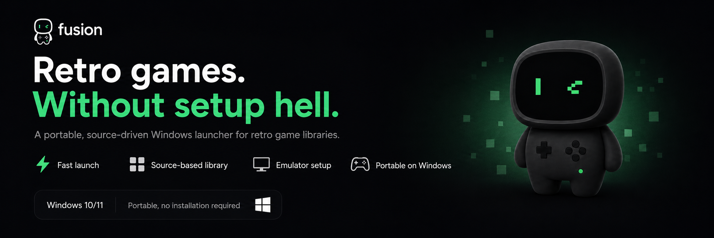

# Fusion Launcher

[English version](README.md)



**Статус:** публичный MVP preview для Windows; свежий Fusion-branded installer
готовится к публикации.
**Репозиторий:** [blessdevhq/fusion-launcher](https://github.com/blessdevhq/fusion-launcher)

Fusion Launcher - source-driven Windows-лаунчер для ретро-библиотек игр на
ПК. Он соединяет просмотр source libraries и отслеживание установки с guided
portable-emulator setup: подключаешь источник, устанавливаешь контент, который
тебе разрешено использовать, закрываешь требования эмулятора и запускаешь всё
из одного desktop-приложения.

Fusion Launcher не хостит, не курирует и не распространяет коммерческие игры,
BIOS, firmware, keys или third-party payloads. Пользователь сам отвечает за
источники и контент, которые подключает.

Проект построен на Next.js, Tauri 2, Rust и локальном хранилище.

## Возможности

- Подключение community, personal или local source-library JSON каталогов из
  GitHub Pages, HTTPS URL или локальных файлов.
- Единый Windows desktop launcher для пользовательских ретро-каталогов игр.
- Отслеживание direct, bundled и torrent-aware установки контента, описанного
  подключенными источниками.
- Валидация schema v3 каталогов с metadata, artwork, тегами, жанрами, setup
  profiles и требованиями к установке.
- Помощь с подготовкой поддерживаемых portable-эмуляторов и локальное хранение
  путей к пользовательским emulator, BIOS, firmware, keys и game files.
- Metadata и artwork из source libraries, ScreenScraper и SteamGridDB, если они
  настроены.
- Preflight-проверки перед запуском эмулятора.
- First-party NES smoke-test репозиторий, diagnostics, health checks, GitHub
  Releases update checks и Windows package smoke tests.

## Первый запуск

Самый быстрый путь на Windows - встроенная demo-настройка:

1. Установи Fusion Launcher.
2. Открой приложение и выбери **Set up demo**.
3. Fusion Launcher подключит встроенный demo-источник, подготовит поддерживаемый
   NES emulator, установит first-party demo cartridge image и включит
   **Play Demo**.

Автоматическая portable-настройка эмуляторов доступна для NES, SNES, Nintendo
64, Game Boy Advance, PlayStation 2 и PSP. PlayStation 1 и Nintendo Switch пока
используют ручной выбор executable. BIOS, firmware и keys всегда остаются
пользовательскими файлами.
Для Nintendo Switch рекомендуемый ручной executable - Eden (`eden.exe` или
`eden-cli.exe`); существующие пути Ryujinx и Suyu остаются fallback-вариантами.

## Модель контента

Fusion Launcher - content-neutral инфраструктура лаунчера. Он подключает
источники, которые выбирает пользователь, скачивает файлы, описанные этими
источниками, и запускает контент через настроенные emulator profiles.

Проект, репозиторий и официальные релизы Fusion Launcher не хостят и не
поставляют коммерческие ROM, BIOS, firmware, keys или third-party игровые
payloads. Пользователи и авторы source libraries отвечают за источники и
контент, которые подключают. Fusion Launcher не аффилирован с проектами
эмуляторов, издателями игр или производителями консолей.

Файл `public/demo-content/fusion-launcher-smoke.nes` - first-party demo
cartridge image для проверки лаунчера. Условия описаны в
`public/demo-content/LICENSE.txt`.

## Source Libraries

Source libraries - это JSON каталоги, описывающие игры, платформы, metadata,
artwork, setup profiles и требования к установке.

Полезные ссылки:

- [Source library template](docs/source-library-template.md)
- [Repository authoring guide](docs/repository-authoring.md)
- [Official starter source](public/source-libraries/official-starter.json) — безопасный первый запуск с first-party demo и openly licensed homebrew.
- [Unofficial player wishlist](public/source-libraries/unofficial-player-wishlist.json) — metadata для коммерческих игр только в режиме user-provided; без downloads, ROM, BIOS, firmware, keys и publisher artwork.
- [Rich metadata example](examples/repositories/showcase.metadata.json)

Готовые URL для вставки в лаунчер:

```text
https://blessdevhq.github.io/fusion-launcher/source-libraries/official-starter.json
https://blessdevhq.github.io/fusion-launcher/source-libraries/unofficial-player-wishlist.json
```

Starter template опубликован по адресу:

```text
https://blessdevhq.github.io/fusion-launcher/source-library-template/repository.json
```

## Разработка

Требования:

- Node.js 22
- Rust stable
- Windows build tools для Tauri desktop builds

Установка зависимостей:

```powershell
npm ci
```

Стандартные проверки:

```powershell
npm test
npm run typecheck
npm run static-check
npm run source:template:check
npm run rust:test
```

Полный local QA gate:

```powershell
npm run qa
```

Запуск web shell:

```powershell
npm run dev
```

Сборка Windows desktop app:

```powershell
npm run tauri:build
```

Валидация source library:

```powershell
npm run source:validate -- templates/source-library/repository.json
```

## Release

Windows release workflow запускается на тегах `vX.Y.Z` и загружает:

- NSIS installer
- updater zip
- updater signature
- `latest.json` для Tauri updater

Для релизной сборки нужен `TAURI_SIGNING_PRIVATE_KEY`; если ключ зашифрован,
также нужен `TAURI_SIGNING_PRIVATE_KEY_PASSWORD`.

Локальный Windows release smoke gate:

```powershell
npm run mvp:release:windows
```

Документация:

- [MVP Windows install checklist](docs/mvp-windows-install.md)
- [Release checklist](docs/release-checklist.md)
- [Metadata and artwork notes](docs/metadata-artwork.md)

## Совместимость

Новые установки используют названия, идентификаторы и файлы Fusion Launcher.
Legacy preview app identifiers, database names и demo identifiers всё ещё
поддерживаются как fallback для существующих preview-установок и CI.

## License

Исходный код Fusion Launcher распространяется по GNU General Public License v3.0
или новее. См. [LICENSE](LICENSE).

Demo smoke-test content покрыт отдельно в `public/demo-content/LICENSE.txt`.
